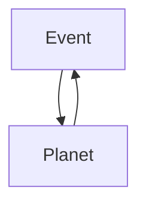

# LifePod

## Requirements
* gcc or clang
* lib ncurses
* make

## Description
The player is a AI in a spaceship. The goal is to find a suitable plantet for humain colonists to live.

## The game:

Event is a random event chosen between all the `.event` files located in the `event_data` directory.
It will damage the ship and will lower score of the player a the end. 

Planet is a set of random values whitch corespond to the the features of a planet.
 - Athmosphere
 - Temperatures
 - Ressources
 - Water
 - Gravity

The game end if
 - there is zero colonist left.
 - the ship sustained to much damage. 

 - the player choose a planet to land.

## The event files
```
system:base_dmg:multiplier_max_value
# The text that will be displayed to the player, when the event will be displayed.
# It can be 10 lines of alphanumeric character.
{ ... }
EOF
```
*system* is the id of the system that will received the damage
1. colonists
2. athmosphere sensor
3. gravity sensor
4. temperature sensor
5. water sensor
6. ressource sensor
7. landing system
8. building system

See an example in the [event folder](event_data/1.event)
